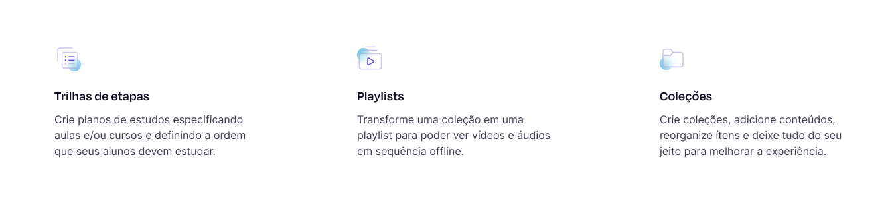

## :rocket: Teste técnico para Desenvolvedor(a) Front-end Sênior na Ensinio

O presente teste foi cuidadosamente planejado por um time em busca da excelência para validar os conhecimentos técnicos necessários para a posição de Desenvolvedor(a) Front-end Sênior na Ensinio.

Serão avaliados aspectos relacionados aos conhecimentos nas melhores práticas de código (observe que não são apenas "boas práticas", mas **as melhores**), testes, princípios arquiteturais de software e documentação, além do **domínio** das tecnologias HTML, CSS, TypeScript, React.js e do ecossistema que as cerca.

É esperado que você resolva os problemas propostos de forma eficiente e elegante (estamos confiantes de que você pode vencer a vontade de fazer gambiarras :stuck_out_tongue_winking_eye:), e demonstre seu raciocínio lógico, atenção a detalhes, capacidade de aprender e agregar valor, ao passo em que entrega uma aplicação de alto nível, à altura da sua capacidade técnica.

Recomendamos partir da premissa fictícia de que o sistema proposto está sendo desenvolvido para compor um projeto de larga escala.

Esperamos também que você se divirta e aprenda algo no processo. :blush:

## :eyes: Os problemas

Suponha que o time de desenvolvedores de uma empresa está crescendo exponencialmente. O front-end, que até então era uma grande aplicação monolítica, precisará ser segregado em serviços, ou aplicações menores, de modo com que o time possa dividir-se em squads independentes e autogerenciáveis.

Um squad não deve afetar ou depender de outros, ainda que, sob perspectiva macro, estejam trabalhando no mesmo "produto de software" (do ponto de vista do usuário). Do ponto de vista da implementação, os squads devem trabalhar em partes isoladas do software.

Você foi encarregado de dar os primeiros passos em uma aplicação que tende a escalar ad infinitum, sendo responsável por projetar e implantar fielmente, sob uma arquitetura de **micro frontends**, o trabalho de um designer inspirado, rs.

- https://www.figma.com/file/M0jy5rqNumytQKuKZYhgPS/Ensinio-Frontend-Challenge

A interface (1 tela), deve ser implementada em 2 micro frontends, divididos da seguinte forma:

Cada micro frontend deve ser uma aplicação totalmente independente, que pode ser mantida por times diferentes e ter ciclos de deploy diferentes, mas que devem funcionar como uma só aos olhos dos usuários.

## :bulb: A proposta: abordagens e tecnologias

A priori, para a realização desse teste, propõe-se 3 aplicações:
- Uma de "base" ou "container", que engloba os micro frontends;
- O 1º micro frontend;
- O 2º micro frontend.

A abordagem para integração dos micro frontends fica a seu critério, mas esteja preparado para justificar sua decisão, embasando-a coerentemente.

Dentro de cada micro frontend, encorajamos o uso de bibliotecas CSS-in-JS como styled-components, sobretudo visando delimitar o escopo da estilização (em seus respectivos componentes), mas para as finalidades deste teste técnico, não é permitido o uso de Bootstrap, Tailwind CSS e congêneres.

Demais tecnologias, como para o gerenciamento de estado compartilhado, ficam a seu critério. No entanto, novamente, você deve estar preparado para justificar suas decisões.

Para a seção abaixo (vide imagem), os títulos e descrições dos itens devem ser requisitados de uma API fictícia. Utilize o [json-server](https://github.com/typicode/json-server) para simular uma API com o arquivo "db.json" contido neste repositório.

Por fim, forneça uma documentação, por meio de um arquivo README.md, acerca do seu projeto. Inclua instruções completas para a execução da aplicação, e comentários que julgar pertinentes à avaliação.

## :dart: Requisitos do projeto

- A interface deve ser **100% responsiva**;
- Fazer uso de uma ou mais ferramentas "linter";
- Escrever ao menos 6 testes unitários (ferramentas a seu critério);
- Implementar tratamento eficiente de erros (error boundaries + logs);
- Demonstrar, em alguma implementação, o princípio da Inversão de Dependências do acrônimo SOLID;
- Requisitar dados (presentes no arquivo "db.json") de uma API fictícia utilizando [json-server](https://github.com/typicode/json-server);
- O projeto deve possuir usabilidade impecável (aos olhos de um usuário o projeto deve funcionar como uma só aplicação; os botões devem ter cursor adequado, feedbacks visuais de hover, etc);
- Implementar a funcionalidade de internacionalização (todos os textos da aplicação devem possuir variações para os idiomas português, inglês e espanhol; a seleção do idioma - por parte do usuário - deve ser persistida);
- Fazer uso de uma abordagem ou ferramenta para o gerenciamento de estado e comunicação entre os micro frontends (pois, ao selecionar um novo idioma na topbar do micro frontend 1, por exemplo, o idioma também deve mudar no micro frontend 2);
- Fornecer uma documentação, incluindo instruções completas para a execução do projeto;

## :clap: Diferenciais

- Animações;
- Alta cobertura de testes;
- Todos os princípios do acrônimo SOLID demonstrados;
- Demonstrar princípios arquiteturais propostos em "Clean Architecture: A Craftsman's Guide to Software Structure and Design".

## :page_facing_up: Critérios de avaliação

- A qualidade do seu **código**;
- O cumprimento dos **requisitos**;
- A **fidelidade** da interface codificada;
- A **performance** (serão utilizados profilers para validar renderizações desnecessárias, etc);
- O **nível de acoplamento** entre os micro frontends (e, também, entre os componentes de cada aplicação);
- A **estrutura** do seu projeto (e de cada aplicação individualmente): esperamos ver componentização coesa, reuso, encapsulamento, separação de responsabilidades, etc;
- A **responsividade** da interface: deve adaptar-se com maestria para absolutamente qualquer tamanho de tela, desde pequenos smartphones até monitores ultrawide;
- Seu **empenho**: não tem problema se algo não sair como desejado, mas tente! :blush:

## :email: Sobre a entrega

Pedimos que, por gentileza, entregue o teste em até 9 dias a partir do recebimento das instruções, preenchendo [este formulário](https://ensinio.atlassian.net/servicedesk/customer/portal/9/group/12/create/55) com o link de um **repositório privado** no GitHub. Neste repositório, adicione como colaborador o usuário [@silviow](https://github.com/silviow) (silvio.mms2016@gmail.com).

Se por motivos de força maior não for possível cumprir com o prazo, por gentileza, nos informe via email. 

Qualquer dúvida, [entre em contato](https://www.linkedin.com/in/silviow/) :muscle:
